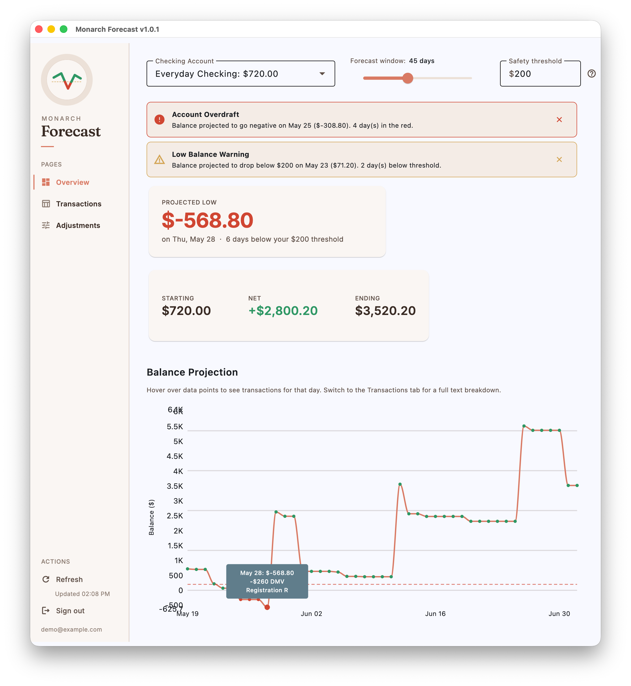
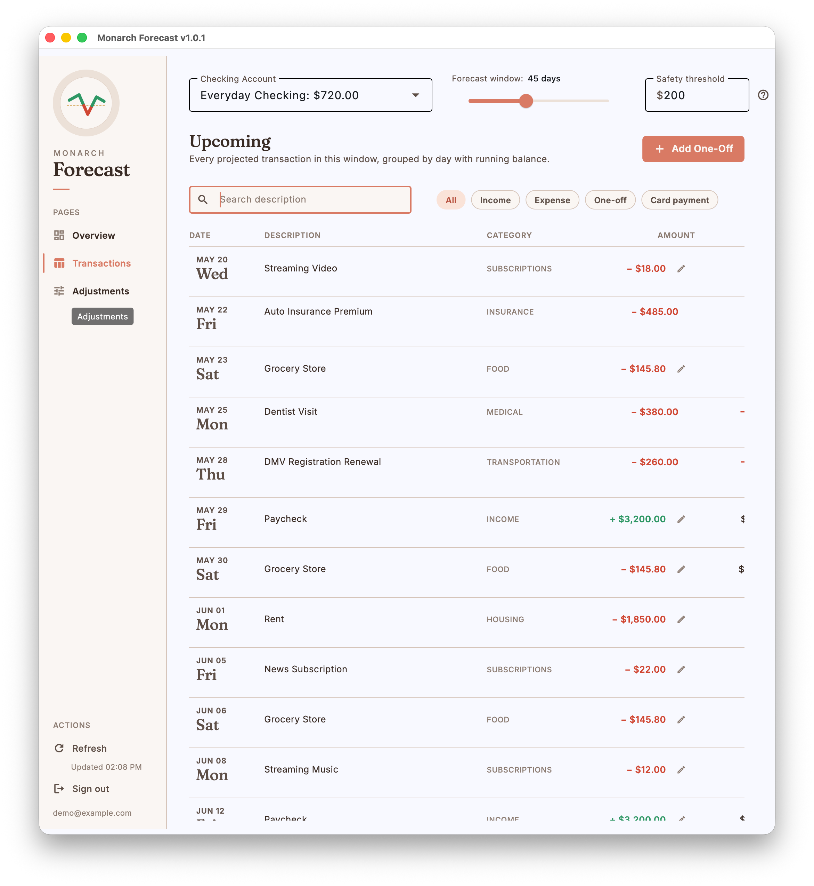
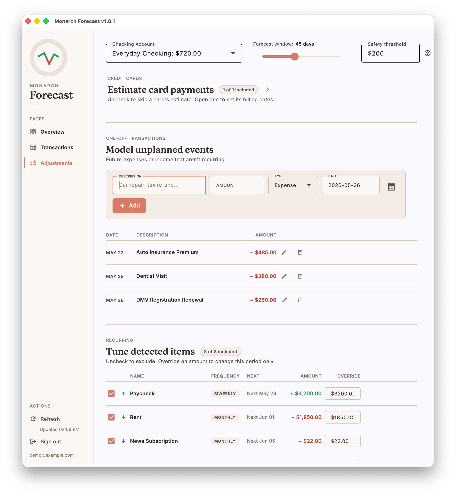

# Monarch Forecast

[](https://github.com/rlorenzo/Monarch-Forecast/releases)
[](https://github.com/rlorenzo/Monarch-Forecast/releases)
[](https://github.com/rlorenzo/Monarch-Forecast/actions/workflows/ci.yml)
[](LICENSE)


[](https://flet.dev)
[](https://github.com/astral-sh/ruff)

A desktop app built with [Flet](https://flet.dev/) (Flutter for Python) that
projects your checking account balance day-by-day using data from
[Monarch Money](https://www.monarchmoney.com/). See where your money is
headed and spot shortfalls before they happen.

## Screenshots

Captured from the built-in demo mode (no Monarch account required: pick
"Try Demo Mode" from the login screen).

### Overview

The dashboard's headline view: low-balance and overdraft alerts up top, the
projected low for the window, starting/net/ending balances, and the
day-by-day balance projection chart.



### Transactions

Three modes, toggled by the pills at the top of the tab (default: Upcoming).
**Upcoming** lists every projected transaction in the forecast window
newest first, grouped by day with the running balance, filterable by
income, expense, one-off, and card payment. **Recent** lists the selected checking account's
completed transactions (last 7 days by default; 30 and 90 available), newest
first, so you can see where your money went. **Both** stacks them into one
reverse-chronological ledger: projected transactions on top, reading down
through a coral TODAY line into recently completed activity, which sits
muted on a tinted band.



### Adjustments

Tune the forecast: include/exclude credit cards, model unplanned one-off
events, and override any detected recurring item's amount for the current
period.



## Features

- **Cash flow forecasting**: Projects your checking account balance 45+
  days ahead by combining recurring income/expenses with one-off
  transactions and credit card payment estimates
- **Low-balance alerts**: Flags dates where your balance is projected to
  drop below a safety threshold
- **Manual adjustments**: Add one-off transactions (upcoming bills,
  expected refunds) to refine the forecast
- **Editorial design**: Custom paper-and-ink design system, Fraunces
  display serif paired with Inter, tabular lining figures across every
  money column. The app ships light-only for now: a dark token ramp is
  defined in the design system but not yet wired into the views
- **Auto-update notifications**: Checks GitHub Releases for newer
  versions on startup
- **Cross-platform**: Builds for macOS (`.dmg`), Windows (`.exe` installer),
  and Linux (`.AppImage`)

### How it works

- **Recurring transactions** are detected by analyzing about two years
  (750 days) of checking history (credit cards only need ~3 months, for
  billing-cycle estimation), cached locally and refreshed incrementally
  so only recent activity is re-downloaded on each load. Cards excluded
  under Adjustments are not fetched or bank-synced at all.
  The app groups by merchant, checks amount consistency (tolerating
  one-off outliers and refunds), infers frequency (weekly, biweekly,
  semimonthly, monthly, bimonthly, quarterly, semiannual, or yearly),
  and drops streams that have gone quiet for more than about 1.5 cycles.
  Penalty fees (NSF, overdraft, late fees) and bare bank descriptors
  ("Deposit", "ATM") are never projected
- **Credit card payments** are estimated by inferring each card's statement
  close and due days (from user settings or payment history), then anchoring
  the statement amount on the account balance rolled back to that close date
  (removing activity that posted after it) rather than summing the cycle's
  charges — a charge dated just before the close but posting after it belongs
  on the next statement, which a date-bucketed sum gets wrong. Falls back to
  the card's recurring payment or current balance when history is insufficient
- Only **checking accounts** are forecasted. Credit card, savings, and
  investment accounts are not included in projections

## Installation

### From a release

Download the latest installer for your platform from
[GitHub Releases](https://github.com/rlorenzo/Monarch-Forecast/releases).

**Platform notes:**

- **macOS**: The `.dmg` is signed with a Developer ID certificate and
  notarized by Apple, so it opens normally — just drag the app to
  Applications and launch it.
- **Windows**: Download `monarch-forecast-windows-setup.exe` and run the
  installer (installs per-user, no admin needed). It isn't code-signed yet, so
  Microsoft Defender SmartScreen shows an "unknown publisher" warning on first
  run — click **More info → Run anyway**.
- **Linux**: Make the `.AppImage` executable and run it:
  `chmod +x monarch-forecast-linux.AppImage && ./monarch-forecast-linux.AppImage`.
  It needs FUSE (`sudo apt install libfuse2` on Debian/Ubuntu).

### From source

Requires Python 3.12+ and [uv](https://docs.astral.sh/uv/).

```bash
git clone https://github.com/rlorenzo/Monarch-Forecast.git
cd Monarch-Forecast
uv sync
uv run monarch-forecast
```

## Usage

On first launch you'll sign in to Monarch Money and select a checking
account. The app projects your balance forward based on recurring
transactions.

1. Launch the app and sign in with your Monarch Money email and password
2. If your account has MFA enabled, you'll be prompted for a code
3. Select a checking account from the dropdown
4. The forecast chart and summary cards update automatically
5. Use the adjustments panel to add one-off transactions

### Authentication and data storage

This app uses [`monarchmoneycommunity`](https://pypi.org/project/monarchmoneycommunity/),
a maintained community fork of
[hammem/monarchmoney](https://github.com/hammem/monarchmoney) — an unofficial,
reverse-engineered API client, since Monarch Money does not offer a public API
(it imports as `monarchmoney`). MFA is supported.

**What is stored locally:**

- **Credentials**: Email and password are stored in your OS keychain via
  [keyring](https://pypi.org/project/keyring/) (macOS Keychain, Windows
  Credential Locker, or SecretService on Linux). Cleared on logout.
- **Session token**: Saved to `~/.monarch-forecast/session.pickle` (file
  permissions `600`) for automatic session restore. Deleted on logout.
- **Preferences**: JSON file at `~/.monarch-forecast/preferences.json`
  storing excluded recurring items, credit card selections, amount
  overrides, and one-off transactions.
- **Transaction cache**: SQLite database at
  `~/.monarch-forecast/cache.db` caching recent Monarch data to avoid
  hammering the API on every launch.

Your financial data is only sent to Monarch Money's servers. The only
other outbound request is an update check to the GitHub Releases API on
startup (no financial data is included).

## Development

This is a [Flet](https://flet.dev/) desktop app. Dependencies are managed
with [uv](https://docs.astral.sh/uv/) via `pyproject.toml` and `uv.lock`.
Always use `uv sync` for local development. Do not install from
`requirements.txt` (it exists only as a fallback for the CI build workflow
and may not reflect the full locked dependency set).

```bash
uv sync                          # install all dependencies (including dev)
uv run monarch-forecast          # run the app
uv run flet run -r src/main.py   # run with hot reload (auto-restarts on file changes)
uv run pytest                    # run tests
uv run ruff check                # lint
uv run ruff format               # format
uv run ty check                  # type check
npx jscpd src                    # copy-paste detection (requires Node; config in .jscpd.json)
```

Set up pre-commit hooks (ruff lint/format, ty type-check, vulture dead-code,
tach module boundaries, bandit security, and jscpd copy-paste detection on
every commit):

```bash
uv run pre-commit install
```

To run the hooks without committing (useful for verifying staged work
before you create the commit), use:

```bash
uv run pre-commit run              # only the currently-staged files
uv run pre-commit run --all-files  # every file in the repo
```

Tests are expected to pass before opening a PR. CI runs lint, type check,
dead-code, module-boundary, security, and copy-paste checks plus the full
test suite on all pull requests.

See [CONTRIBUTING.md](CONTRIBUTING.md) for the contribution and testing
policy, and [SECURITY.md](SECURITY.md) if you've found a vulnerability.

### Demo mode

The login screen has a **Try Demo Mode** button that opens the dashboard
against synthetic data, so you can explore the app before entering your
Monarch credentials. Useful for evaluating the app before connecting real
financial data, taking screenshots, and reproducing bug reports.

The demo fixture is a designed forecast: one checking account, one credit
card, a biweekly paycheck, monthly rent and bills, weekly groceries, and
current-cycle credit-card charges. Dates are generated relative to today,
so the forecast is always fresh. Demo state is stored separately at
`~/.monarch-forecast/demo-cache.db` and
`~/.monarch-forecast/demo-preferences.json`, so experimenting with demo
mode will not touch your real preferences or cached data.

Signing out of demo mode returns to the login screen.

### Building desktop packages locally

Building native installers requires Flutter and platform toolchains:

```bash
brew install --cask flutter       # install Flutter SDK
brew install cocoapods            # required for macOS builds (see note below)
# --exclude keeps .venv/.git/tests out of the bundle — without it the app
# balloons by ~55 MB and macOS notarization fails. See packaging/macos/README.md
# for the full signed + notarized release flow (and Windows/Linux packaging).
uv run flet build macos \
  --project "Monarch Forecast" --org com.monarchforecast \
  --product "Monarch Forecast" \
  --exclude .venv .git tests .github screenshots design web packaging \
  --compile-app --compile-packages   # → build/macos/Monarch Forecast.app
```

**macOS CocoaPods note:** Do not use `sudo gem install cocoapods`. The
system Ruby (2.6) is too old and the install will fail with `ffi` gem
errors. Use `brew install cocoapods` instead, which bundles its own Ruby.
If `flutter doctor` still reports CocoaPods as broken after installing,
run `brew reinstall cocoapods`.

See the [Flet packaging guide](https://flet.dev/docs/publish) for other
platform-specific requirements.

### Project structure

```text
src/
├── main.py                 # Flet app entry point
├── auth/                   # Login UI and session management (keyring + MFA)
├── data/                   # Monarch API client, caching, credit card estimation
├── forecast/               # Day-by-day balance projection engine and data models
├── utils/                  # Date helpers, GitHub release update checker
└── views/                  # Dashboard, chart, alerts, adjustments, update banner
```

## Accessibility

Monarch Forecast is built to be usable with a screen reader, keyboard
only, at increased text size, or in high-contrast themes. Known support
level:

- **Screen readers**: Every icon-only button carries a descriptive label,
  the balance chart exposes a text summary (start balance, ending balance,
  lowest point, threshold crossings), form errors are announced via live
  regions, and the Alerts banner is a live region so new
  shortfall/overdraft notices are spoken when they appear. Best-tested
  with **VoiceOver on macOS**; **Narrator on Windows** works for buttons
  and form fields. **Orca on Linux** has uneven support in Flutter desktop
  today. If you rely on Orca, expect gaps and please open an issue with
  what you hit.
- **Keyboard**: `Tab`/`Shift+Tab` moves between controls, `Esc` closes
  any open dialog, and global shortcuts work from anywhere in the
  dashboard:
  - `⌘R` / `Ctrl+R`: refresh data
  - `⌘1` / `Ctrl+1`: Overview tab
  - `⌘2` / `Ctrl+2`: Transactions tab
  - `⌘3` / `Ctrl+3`: Adjustments tab
  - `⌘4` / `Ctrl+4`: cycle the Transactions tab through Upcoming, Recent,
    and Both

  Switching tabs auto-focuses the first meaningful control of the new
  tab. Date fields in the one-off transaction forms accept typed input
  (`YYYY-MM-DD`, `Jan 05, 2026`, `01/05/2026`), so you never have to open
  the calendar popover with a mouse.
- **Text scaling**: Icons grow with the OS text size (via the app's
  Material icon theme). Secondary text uses the theme-aware
  `ON_SURFACE_VARIANT` color so it remains readable in both light and
  dark modes.
- **Reduce motion**: On platforms that expose the "reduce motion"
  accessibility flag, the balance chart draws as straight line segments
  instead of a curved spline.
- **Alternative to the chart**: If you can't use the balance chart, the
  **Transactions** tab is a full text equivalent. Every projected
  transaction with date, description, amount, and running balance, in a
  screen-reader-friendly data table.

**Reporting an accessibility bug:** open an issue at
[GitHub Issues](https://github.com/rlorenzo/Monarch-Forecast/issues) with
the label `accessibility`. Include your platform, your assistive
technology (e.g. VoiceOver, NVDA, Narrator, Orca), and what you expected
vs what happened. Even small reports help.

## Troubleshooting

- **Login fails or session won't restore**: Delete
  `~/.monarch-forecast/session.pickle` and try again. If MFA is enabled
  on your Monarch account, make sure you enter the code when prompted.
- **Keychain access denied**: On macOS, the app needs Keychain Access
  permission. On Linux, make sure a SecretService provider (like
  `gnome-keyring` or `kwallet`) is running.
- **"App is damaged" / Gatekeeper warning (macOS)**: Releases are notarized,
  so this shouldn't occur. If it does, the download was likely corrupted or
  altered — re-download the `.dmg` from GitHub Releases. As a fallback you can
  right-click the app and choose "Open", or allow it in System Settings >
  Privacy & Security.
- **AppImage won't run (Linux)**: Make sure it's executable
  (`chmod +x monarch-forecast-linux.AppImage`). You may also need FUSE
  installed (`sudo apt install libfuse2` on Ubuntu).
- **Update banner doesn't appear**: The update check is best-effort and
  requires internet access. It queries the GitHub Releases API on startup;
  failures are silently ignored.

## License

MIT
